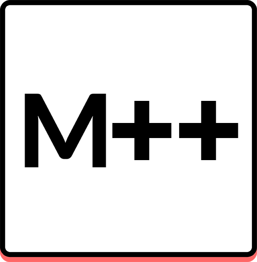

<a name="readme-top"></a>

[![Contributors][contributors-shield]][contributors-url]
[![Forks][forks-shield]][forks-url]
[![Stargazers][stars-shield]][stars-url]
[![Issues][issues-shield]][issues-url]
[![MIT License][license-shield]][license-url]

<br />
<div align="center">
  <a href="https://github.com/SuperDoduos/MechVibesPlusPlus">
    
  </a>

  <h1 align="center">MechVibes++ 2026</h1>
  <p align="center">
    Version 3.0.0 of the MechVibes++ fork, refreshed for modern Electron and native input handling.
  </p>
</div>

## About

MechVibes++ 2026 plays mechanical keyboard and mouse sounds while you type and click. It keeps the original MechVibes++ feature set, including mouse sounds, key up/down sounds, randomized sounds, custom soundpacks, and the soundpack editor.

This fork is maintained and modernized by [SuperDoduos](https://github.com/SuperDoduos).

The original MechVibes++ project was created by Pyro & Saturn and is based on the original Mechvibes project. Their work remains credited and respected in this fork.

## What's New In 3.0.0

- Updated the app identity to `MechVibes++ 2026`.
- Updated the package version to `3.0.0`.
- Upgraded Electron from the old Electron 6 stack to Electron 41.
- Upgraded `electron-builder` to the modern 26.x build toolchain.
- Replaced the old `iohook` dependency with `uiohook-napi`.
- Moved global keyboard/mouse hooks into the Electron main process and forwarded events to the renderer with IPC.
- Disabled native dependency rebuilds during packaging so prebuilt N-API binaries are used instead of forcing local Visual Studio Build Tools.
- Updated Windows Redistributable handling from VC++ 2015-2019 to VC++ 2015-2022.
- Updated `electron-store`, `glob`, `fs-extra`, and related package metadata.
- Removed unused legacy dependencies from `package.json`.
- Fixed Windows path handling for soundpack discovery.
- Fixed release version comparison so `3.0.0` is compared numerically instead of as plain text.
- Updated README, app footer, and GitHub links for the SuperDoduos fork while preserving original project credits.

## Built With

- [Electron](https://www.electronjs.org/)
- [Node.js](https://nodejs.org/)
- [uiohook-napi](https://github.com/SnosMe/uiohook-napi)
- [Howler.js](https://howlerjs.com/)

## Requirements

- Windows 10 or newer
- 64-bit x64 PC
- Node.js 20 or newer for development
- Microsoft Visual C++ Redistributable 2015-2022
- About 250 MB of free storage

## Running From Source

Install dependencies:

```powershell
npm install
```

Start the app:

```powershell
Remove-Item Env:ELECTRON_RUN_AS_NODE -ErrorAction SilentlyContinue
npm start
```

The `ELECTRON_RUN_AS_NODE` line is only needed when your shell environment has that variable set.

## Building

Create an unpacked Windows build:

```powershell
npm run build:quick
```

Create the Windows installer:

```powershell
npm run build:win
```

The installer is generated in `dist/`.

## Soundpacks

Custom keyboard soundpacks are loaded from:

```text
%USERPROFILE%\mechvibes_custom
```

Custom mouse soundpacks are loaded from:

```text
%USERPROFILE%\mousevibes_custom
```

Use the tray menu to open these folders or refresh soundpacks.

## Notes

If a game or another application is running as Administrator, MechVibes++ 2026 may also need to run as Administrator to receive global input events.

Windows Defender or other anti-virus software may warn about the app because it listens for global keyboard and mouse events. The app uses those events only to match the selected soundpack and play sounds.

## Credits

- 2026 modernization and maintenance: [SuperDoduos](https://github.com/SuperDoduos)
- Original MechVibes++ work: Pyro & Saturn
- Original Mechvibes project: [hainguyents13/mechvibes](https://github.com/hainguyents13/mechvibes)

## License

Distributed under the MIT License. See [LICENSE](LICENSE) for details.

<p align="right">(<a href="#readme-top">back to top</a>)</p>

[contributors-shield]: https://img.shields.io/github/contributors/SuperDoduos/MechVibesPlusPlus.svg?style=for-the-badge
[contributors-url]: https://github.com/SuperDoduos/MechVibesPlusPlus/graphs/contributors
[forks-shield]: https://img.shields.io/github/forks/SuperDoduos/MechVibesPlusPlus.svg?style=for-the-badge
[forks-url]: https://github.com/SuperDoduos/MechVibesPlusPlus/network/members
[stars-shield]: https://img.shields.io/github/stars/SuperDoduos/MechVibesPlusPlus.svg?style=for-the-badge
[stars-url]: https://github.com/SuperDoduos/MechVibesPlusPlus/stargazers
[issues-shield]: https://img.shields.io/github/issues/SuperDoduos/MechVibesPlusPlus.svg?style=for-the-badge
[issues-url]: https://github.com/SuperDoduos/MechVibesPlusPlus/issues
[license-shield]: https://img.shields.io/github/license/SuperDoduos/MechVibesPlusPlus.svg?style=for-the-badge
[license-url]: https://github.com/SuperDoduos/MechVibesPlusPlus/blob/main/LICENSE
